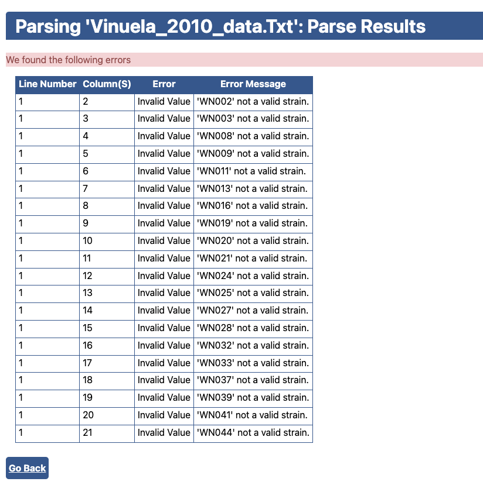

# Overview

This script is used to record Python functions that contribute to learning the [GeneNetwork](https://genenetwork.org/).  It mainly includes self-made functions and a hands-on tutorial of the 3rd GeneNetwork Uploader.


## Functions

Useful functions involved in API will be introduced here for beginners. 


## Uploader

[The genotypic (gene expression) and phenotypic (maps) data of C. elegans](http://www.genome.org/cgi/doi/10.1101/gr.102160.109) were applied to test the uploader.  A short description of the genotype and phenotype data is: The recombinant inbred lines of *C. elegans* were driven by the wildtypes N2 and CB4856. The phenotype is about the lifespan per recombinant inbred line using the *E.coli (OP50)* as a food source.  Part of the phenotype and genotype data are indicated below:

### Phenotype

- Columns like "WN001" are individual worms per recombinant inbred line. 
- Rows are the phenotypic traits, i.e. the calculated lifespan per worm. 

```shell
											WN001			WN002				WN003				WN008			WN009		
lifespan/mean/days		14.30667	14.23288		15.46154		13.375		13.17143
lifespan/TD50/days		12.86			12.8				16.15				13.11			11.25
```

### Genotype

- Rows are the bin markers on the genome. 

```shell
					WN001			WN002			WN003			WN008		WN009		
binI10000		1					1					1					1				1
binI20000		1					1					1					1				1
binI30000		1					1					1					1				1
```


 The dataset is stored under the parallel folder namely "C.elegans_data". Alternatively, you can also download them by clicking the buttons "Markers" and "Expression data" on the website "https://www.bioinformatics.nl/EleQTL/?mode=correlation". 


### 


The website [https://bioart.io/](https://bioart.io/) has a user-friendly interface for uploading personal data. The genotype data should be uploaded with the "Average" option, while phenotype data should be uploaded with the "Standard Error" option. Using the mentioned C.elegans data as an example,  you will find below errors:



